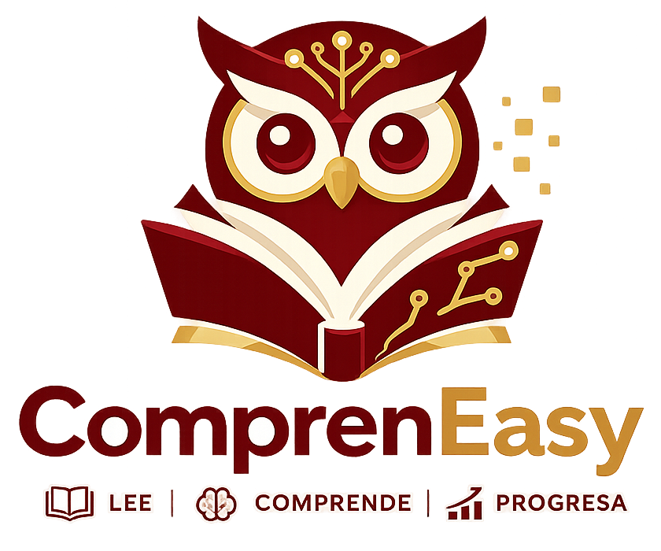

# ComprenEasy.Ng 🚀

<p align="center">
  
</p>

An adaptive reading comprehension platform built with **Angular 20**.

## 📖 Overview

**ComprenEasy** is an educational platform designed to enhance reading comprehension through adaptive learning. It guides students through a structured academic flow, providing personalized reading recommendations based on their performance in pre-tests. The platform aim to provide a personalized experience that adapts to each student's specific needs and level.

## ✨ Key Features

### 👨‍🎓 For Students
- **Dynamic Dashboard:** Track your progress and current academic stage at a glance.
- **Adaptive Academic Flow:** A guided journey from **Pre-tests** to **Personalized Readings** and final **Post-tests**.
- **Interactive Reading Sessions:** Engage with content specifically selected to match your comprehension level.
- **Result Analysis:** Detailed feedback on evaluation attempts and progress comparison.

### 👩‍🏫 For Teachers
- **Student Monitoring:** Visualize detailed progress and performance for every student.
- **Content Management System:** Full control over:
  - **Readings:** Manage the library of educational texts.
  - **Assessments:** Create and configure pre-tests and post-tests.
  - **Question Bank:** Organize and manage questions for different comprehension levels.
- **Academic Control:** Manage student stages and overall classroom performance.

## 🛠️ Technology Stack

- **Framework:** [Angular 20](https://angular.dev/) (Standalone Components architecture)
- **Language:** [TypeScript](https://www.typescriptlang.org/)
- **Reactive Programming:** [RxJS](https://rxjs.dev/)
- **Security:** Role-based access control (RBAC), Interceptors, and Route Guards.
- **Design:** Modern UI built with Vanilla CSS and responsive principles.

## 🚀 Getting Started

### Prerequisites

- **Node.js**: Latest LTS version.
- **Angular CLI**: `npm install -g @angular/cli`

### Installation

1. **Clone the repository:**
   ```bash
   git clone https://github.com/jacko102040-cell/ComprenEasy.Ng.git
   ```

2. **Navigate to the project directory:**
   ```bash
   cd ComprenEasy.Ng
   ```

3. **Install dependencies:**
   ```bash
   npm install
   ```

### Development Server

Run the following command to start the local development server:

```bash
npm start
```

Open your browser and navigate to `http://localhost:4200/`. The application will automatically reload if you change any of the source files.

## 📁 Project Structure

```text
src/app/
├── core/           # Singleton services, models, guards, and interceptors
├── features/       # Feature-based pages and logic
│   ├── auth/       # Login and Registration
│   ├── dashboard/  # Student main view
│   ├── readings/   # Reading list and active sessions
│   ├── evaluations/# Pre/Post tests and results
│   ├── content/    # Teacher content management
│   └── teacher/    # Teacher student monitoring
├── shared/         # Reusable components (Header, etc.)
└── app.routes.ts   # Main routing configuration
```

## 🧪 Testing

Execute unit tests using the Karma test runner:

```bash
npm test
```

## 🏗️ Building

To build the project for production:

```bash
npm run build
```

The build artifacts will be stored in the `dist/` directory.

## 📄 Project Status

This project is currently under development as part of a **University Thesis**.

---

<p align="center">
  <b>ComprenEasy</b> - Transformando la comprensión lectora.
</p>
